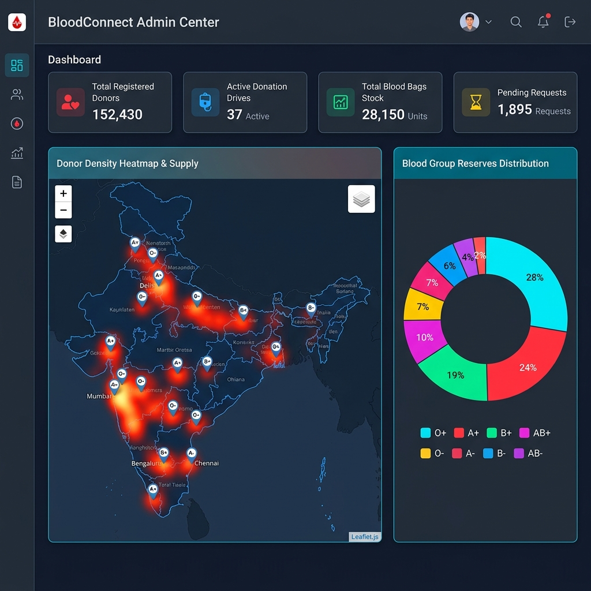
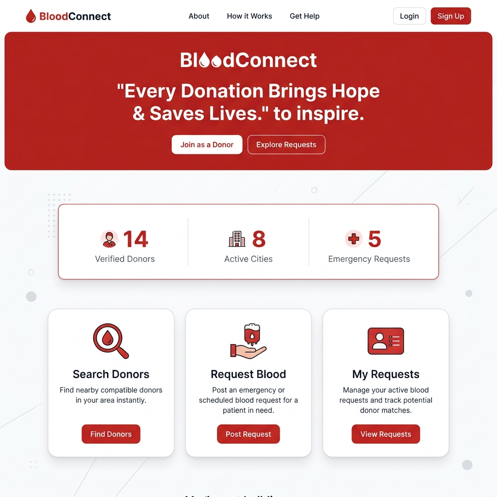

# 🩸 BloodConnect - Emergency Blood Donor Finder & Management System

BloodConnect is a web application designed to connect patients in need of emergency blood with verified donors in real time. It features spatial donor density heatmaps, reserve analytics, donor compatibility matching, and automated database failover.

---

## 📸 Screenshots & Dashboards

### 🛡️ Admin Command Center & Geographic Heatmap


### 🏠 User Home & Response Network


---

## ✨ Key Features

- **Spatial Donor Heatmaps & Mapping (Leaflet.js)**: Live spatial mapping of verified donors across regional hubs (Nashik, Mumbai, Pune, Delhi, Bangalore, etc.) with custom blood group markers and density heatmaps.
- **Visual Reserve Analytics (Chart.js)**: Real-time doughnut charts showing distribution of blood group reserves (`A+`, `A-`, `B+`, `B-`, `AB+`, `AB-`, `O+`, `O-`).
- **Blood Group Compatibility Engine**: Intelligent compatibility matching rules ensuring recipients (e.g. `A+`) receive donors from compatible groups (`A+`, `A-`, `O+`, `O-`).
- **Zero-Setup Database Architecture**: Seamless automatic fallback to an embedded SQLite database (`bloodfinder.db`) if MySQL is not running locally.
- **Role-Based Security & Password Hashing**: Route protection via `@login_required` and `@admin_required` decorators with Werkzeug `scrypt` password hashing.
- **Emergency Broadcast Alerts**: One-click dispatch of urgent email alerts to matching verified donors.
- **My Requests Tracker**: Personal dashboard for users to track submitted requests and fulfillment status.

---

## 🔑 Default Credentials

| Role | Username / Email | Password |
| :--- | :--- | :--- |
| **Admin** | `admin@admin` | `admin` |
| **Admin** | `admin` | `admin` |
| **Admin** | `hamizkhan@ggsf.edu.in` | `12345678` |
| **User** | `hamizkhan@ggsf.edu.in` | `12345678` |

---

## 🚀 Getting Started

### 1. Prerequisites
- Python 3.8+
- Git

### 2. Installation
```bash
# Clone the repository
git clone https://github.com/Hamizkhan08/Blood-Donater-Finder-and-Management-.git
cd Blood-Donater-Finder-and-Management-

# Install required dependencies
pip install -r requirements.txt
```

### 3. Running the Application
```bash
python app.py
```
Open your browser and navigate to: **`http://127.0.0.1:5000`**

*(The application automatically initializes default admin/user accounts and sample data on first boot).*

---

## 🛠️ Tech Stack

- **Backend**: Python (Flask, Werkzeug)
- **Database**: MySQL (PyMySQL) with automatic SQLite fallback (`sqlite3`)
- **Frontend**: HTML5, Vanilla CSS, Tailwind CSS, JavaScript (ES6)
- **Analytics & Mapping**: Chart.js, Leaflet.js, Leaflet.heat
- **Security & Mail**: Werkzeug Security, Flask-Mail, python-dotenv

---

## 📄 License
Distributed under the MIT License.
